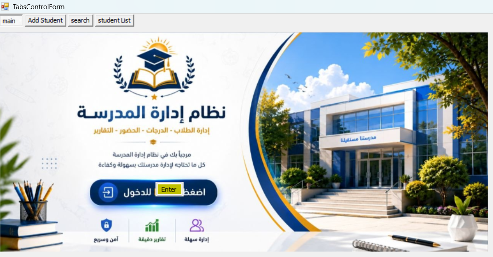
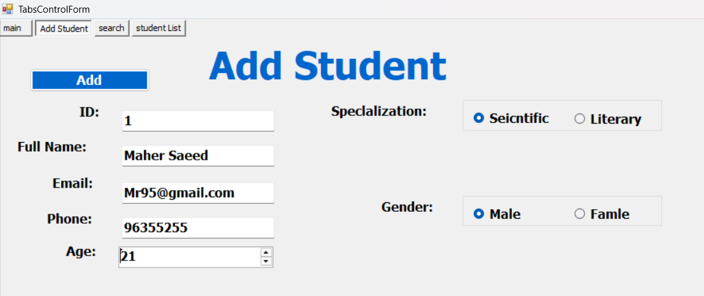
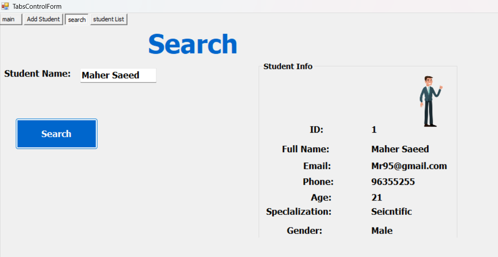
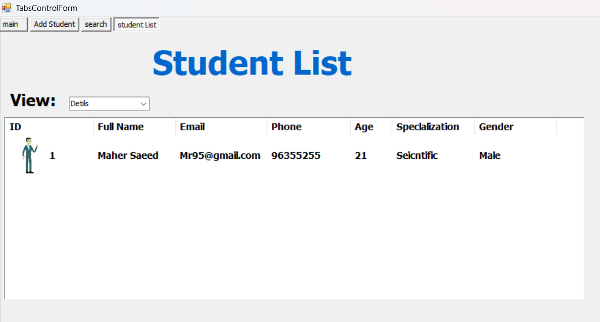

# Project-4-SchoolManagementSystem
Windows Forms school management interface with tabs for adding students, searching student records, and viewing the student list in multiple display modes.

🎓 School Management System

A simple and organized Windows Forms desktop application developed using C# for managing and displaying student information through an easy-to-use tab-based interface.

---

📸 Preview

🏠 Main Page

➕ Add Student

 🔍 Search

 📋 Student List

---

✨ Features

🏠 Main Page

- Welcome screen with a school-themed interface.
- Simple navigation between application sections.

➕ Add Student

- Add new student records.
- Enter student information including:
  - 🆔 ID
  - 👤 Full Name
  - 📧 Email Address
  - 📞 Phone Number
  - 🎂 Age

⚧ Student Information

- Gender selection support.
- Specialization selection:
  - 🔬 Scientific
  - 📚 Literary

🔍 Search

- Search for students by name.
- Display student information directly from the search result.

📋 Student List

- Display students in a ListView control.
- Support for multiple display modes:
  - 📑 Details
  - 🖼️ Large Icon
  - 📃 List
  - 🔹 Small Icon
  - 🧩 Tile

👤 Student Preview

- Display selected student information together with a profile image.

---

🛠️ Technologies Used

- 💻 C#
- 🪟 Windows Forms
- 📦 .NET Framework
- 📋 ListView
- 🖼️ ImageList
- 📑 TabControl

---

📂 Application Sections

- 🏠 Main
- ➕ Add Student
- 🔍 Search
- 📋 Student List

---

🎯 Project Purpose

This project was created as a practical exercise for learning and improving skills in:

- Windows Forms development.
- Event-driven programming.
- Working with ListView controls.
- Designing desktop user interfaces.
- Organizing and displaying data in a structured way.

---

🚀 Future Improvements

Possible future enhancements include:

- 🗄️ Database integration.
- ✏️ Editing existing student records.
- ❌ Deleting student records.
- 📤 Exporting data.
- 📊 Reporting and statistics.

---

📄 License

This project is available for educational and learning purposes.
